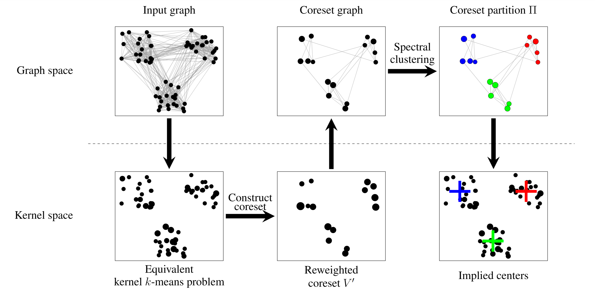

# coreset-sc
This repository provides an approximate spectral clustering algorithm that can scale far beyond the original algorithm, while still producing similar results.


This repo contains a minimal implementation of the Coreset Spectral Clustering (CSC) algorithm given in [this paper](https://openreview.net/pdf?id=1qgZXeMTTU).

The presented method repeatedly jumps across the equivalence between the normlised cut and weighted kernel k-means problems to apply coreset methods to spectral clustering.

Combined with [recent work on fast spectral clustering](https://neurips.cc/virtual/2023/poster/71723), this gives us a method for clustering very large graphs (millions of nodes) in seconds by only running (fast) spectral clustering on a much smaller induced subgraph. It can do so in even the most extreme case, where the number of clusters is linear in the number of nodes. See the experiments section the [paper](https://openreview.net/pdf?id=1qgZXeMTTU).




Installation: `pip install coreset-sc`

Basic usage:
```python
from coreset_sc import CoresetSpectralClustering, gen_sbm
from sklearn.metrics.cluster import adjusted_rand_score

# Generate a graph from the stochastic block model
n = 1000            # number of nodes per cluster
k = 50              # number of clusters
p = 0.5             # probability of an intra-cluster edge
q = (1.0 / n) / k   # probability of an inter-cluster edge


# A is a sparse scipy CSR matrix of a symmetric adjacency graph
A,ground_truth_labels = gen_sbm(n, k, p, q)

coreset_ratio = 0.1 # fraction of the data to use for the coreset graph

csc = CoresetSpectralClustering(
    num_clusters=k, coreset_ratio=coreset_ratio
)
csc.fit(A) # sample extract and cluster the coreset graph
csc.label_full_graph() # label the rest of the graph given the coreset labels
pred_labels = csc.labels_ # get the full labels

# Alternatively, label the full graph in one line:
pred_labels = csc.fit_predict(A)
ari = adjusted_rand_score(ground_truth_labels,pred_labels)
```


[Python Docs](https://benjourdan.github.io/coreset-sc/)
